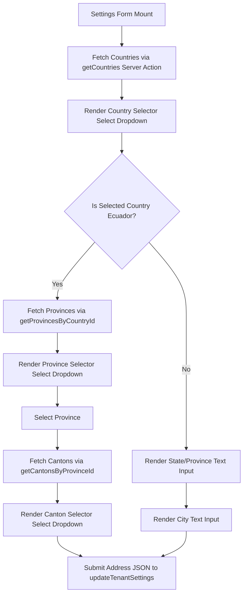
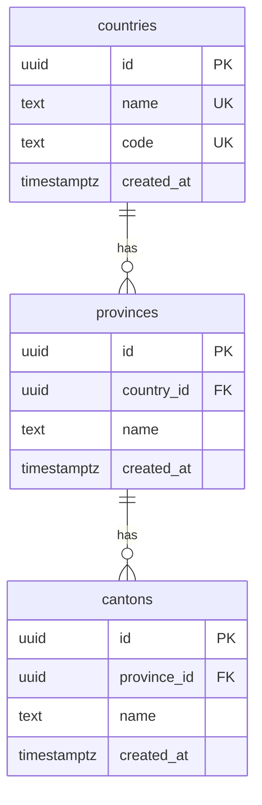

# Technical Design: Address Locations Ecuador

This design document outlines the technical approach, database schema, server actions, UI changes, and testing strategy for implementing structured address locations (Country -> Province -> Canton) optimized for Ecuador, with plain text fallbacks for other countries.

## 1. Technical Approach

The goal is to replace the free-text input fields for Country, Province, and City in the merchant dashboard settings with a hierarchical, validated selector when the merchant is located in Ecuador, while maintaining a smooth fallback to plain text fields for other countries (e.g., Colombia, Peru).

### Data Flow Diagram



### Key Decisions

1. **State Isolation**: Sub-regions (provinces and cantons) are loaded dynamically on the client side only when "Ecuador" is selected. This avoids transferring unnecessary seed data for other countries to the client.
2. **Cascading Reset**: 
   - Changing the country resets both the selected province and canton to empty values.
   - Changing the province resets the selected canton to an empty value.
3. **Data Storage Format**: The final values are serialized into the existing `address` JSON field on the `tenants` table. This keeps the schema compatible with existing records, parsing legacy address strings gracefully.
4. **Storefront Presentation**: The storefront footer dynamically concatenates the fields, omitting any empty properties to avoid dangling commas.

---

## 2. Database Schema

We introduce three new lookup tables in the `public` schema with proper foreign key relationships, cascade deletes, and unique constraints.

### Entities Relationship Diagram



### Table Definitions

#### `public.countries`
```sql
CREATE TABLE IF NOT EXISTS public.countries (
    id uuid PRIMARY KEY DEFAULT gen_random_uuid(),
    name text UNIQUE NOT NULL,
    code text UNIQUE NOT NULL,
    created_at timestamp with time zone DEFAULT now()
);
```

#### `public.provinces`
```sql
CREATE TABLE IF NOT EXISTS public.provinces (
    id uuid PRIMARY KEY DEFAULT gen_random_uuid(),
    country_id uuid REFERENCES public.countries(id) ON DELETE CASCADE,
    name text NOT NULL,
    created_at timestamp with time zone DEFAULT now(),
    UNIQUE(country_id, name)
);
```

#### `public.cantons`
```sql
CREATE TABLE IF NOT EXISTS public.cantons (
    id uuid PRIMARY KEY DEFAULT gen_random_uuid(),
    province_id uuid REFERENCES public.provinces(id) ON DELETE CASCADE,
    name text NOT NULL,
    created_at timestamp with time zone DEFAULT now(),
    UNIQUE(province_id, name)
);
```

### Row Level Security (RLS) Select Policies
Read access to geographical lookup data must be publicly available. Mutation is forbidden for normal users.

```sql
ALTER TABLE public.countries ENABLE ROW LEVEL SECURITY;
ALTER TABLE public.provinces ENABLE ROW LEVEL SECURITY;
ALTER TABLE public.cantons ENABLE ROW LEVEL SECURITY;

CREATE POLICY "Allow public read access to countries" ON public.countries
    FOR SELECT TO public USING (true);

CREATE POLICY "Allow public read access to provinces" ON public.provinces
    FOR SELECT TO public USING (true);

CREATE POLICY "Allow public read access to cantons" ON public.cantons
    FOR SELECT TO public USING (true);
```

### Seeding Strategy
Seed data is included directly within the migration SQL. The geographical structure is seeded as follows:
- **Countries**: Ecuador (EC), Colombia (CO), Peru (PE).
- **Provinces & Cantons**: Loaded from the Ecuador geographical reference JSON. The SQL inserts all 24 provinces (Azuay, Bolívar, Cañar, etc.) and links the ~224 cantons (Cuenca, Gualaceo, Quito, Guayaquil, etc.) to their respective province records via nested queries or hardcoded sub-selects.

---

## 3. Server Actions

Three new read-only Server Actions will be exposed in `src/lib/tenants/actions.ts`:

```typescript
export interface Country {
  id: string;
  name: string;
  code: string;
}

export interface Province {
  id: string;
  country_id: string;
  name: string;
}

export interface Canton {
  id: string;
  province_id: string;
  name: string;
}

/**
 * Fetches all seeded countries.
 */
export async function getCountries(): Promise<ActionResult<Country[]>> {
  try {
    const supabase = await createClient();
    const { data, error } = await supabase
      .from("countries")
      .select("id, name, code")
      .order("name", { ascending: true });

    if (error) return { success: false, error: error.message };
    return { success: true, data: data as Country[] };
  } catch (err) {
    console.error(err);
    return { success: false, error: "Error fetching countries" };
  }
}

/**
 * Fetches provinces matching the selected country UUID.
 */
export async function getProvincesByCountryId(countryId: string): Promise<ActionResult<Province[]>> {
  try {
    const supabase = await createClient();
    const { data, error } = await supabase
      .from("provinces")
      .select("id, country_id, name")
      .eq("country_id", countryId)
      .order("name", { ascending: true });

    if (error) return { success: false, error: error.message };
    return { success: true, data: data as Province[] };
  } catch (err) {
    console.error(err);
    return { success: false, error: "Error fetching provinces" };
  }
}

/**
 * Fetches cantons matching the selected province UUID.
 */
export async function getCantonsByProvinceId(provinceId: string): Promise<ActionResult<Canton[]>> {
  try {
    const supabase = await createClient();
    const { data, error } = await supabase
      .from("cantons")
      .select("id, province_id, name")
      .eq("province_id", provinceId)
      .order("name", { ascending: true });

    if (error) return { success: false, error: error.message };
    return { success: true, data: data as Canton[] };
  } catch (err) {
    console.error(err);
    return { success: false, error: "Error fetching cantons" };
  }
}
```

---

## 4. UI Changes

### Settings Form (`src/components/dashboard/settings-form.tsx`)

The form will transition state variables for dynamic fields:
- `countries`: Loaded on mount.
- `provinces`: Loaded when Country is Ecuador.
- `cantons`: Loaded when a Province is selected.

#### Logic Structure
1. The **Country** field becomes a `<Select>` element showing options from the `countries` table.
2. If `country === "Ecuador"`, we render the **Province** and **City** fields as `<Select>` components.
3. If `country !== "Ecuador"`, we render the **Province** and **City** fields as simple `<Input type="text">` elements.
4. Cascading cleanups:
   ```typescript
   // On Country change:
   if (newCountry !== "Ecuador") {
     form.setValue("state", "");
     form.setValue("city", "");
   } else {
     form.setValue("state", "");
     form.setValue("city", "");
     // trigger provinces fetch
   }

   // On Province change:
   form.setValue("city", "");
   // trigger cantons fetch
   ```

### Storefront Layout Footer (`src/app/[slug]/page.tsx`)

Update the footer element of the public storefront route to format and display the address when `show_address` is enabled.

```tsx
{tenant.public_settings?.show_address && formattedAddress && (
  <div className="text-xs text-muted-foreground mt-2 font-medium">
    Dirección: {formattedAddress}
  </div>
)}
```

The formatting helper function `formatAddress` (defined on line 77) already processes the JSON object structure by joining truthy fields (`street`, `city` as canton, `state` as province, `country`) with `, `. We will ensure the output strictly renders `[Street], [Canton], [Province], [Country]` without consecutive commas.

---

## 5. Rationale & Architecture Decisions

### React Component Placement
To maintain a clean separation of concerns and avoid server-side dependency leakage, the database fetch actions are designed as Next.js Server Actions.
- Data lookup is fetched via Server Actions rather than API routes, simplifying Supabase client initialization.
- Props are passed down to child components where needed (for example, passing plan settings or parent actions) to ensure presentation views remain lightweight and testable.

### Component Isolation and plan widgets (e.g. `free-plan-widgets.tsx`)
In line with dashboard layouts, plan-specific indicators or widget forms are split into isolated React client components to maintain modularity. This isolation ensures that layout differences between the Free Plan and Business Plan do not bloat the primary settings view bundle, adhering to performance budgets.

---

## 6. Testing Strategy

We write two distinct testing scripts:

### A. Static Migration Structure Validation
`supabase/migrations/20260609220924_address_locations_ecuador.test.ts`
Using Vitest and Node's file system, we verify that:
1. The migration file exists.
2. The DDL script contains table creation strings for `countries`, `provinces`, and `cantons`.
3. RLS policy creation lines are present.
4. Inserts for Ecuador, Colombia, and Peru are present.

### B. UI Cascading Selects Behavior Testing
`src/components/dashboard/settings-form.test.tsx`
We will expand the existing UI tests using `@testing-library/react` and `@testing-library/user-event`:
1. **Mock Actions**: Mock `getCountries`, `getProvincesByCountryId`, and `getCantonsByProvinceId`.
2. **Standard Fallback assertion**: Verify that if a non-Ecuador country (e.g., Colombia) is selected, standard `<input>` textboxes are rendered.
3. **Ecuador Select assertion**: Verify that selecting "Ecuador" triggers the transition of state and city to `<select>` dropdowns and triggers the `getProvincesByCountryId` action.
4. **Cascading load assertion**: Verify that selecting a province triggers `getCantonsByProvinceId` and updates the city selector's options.
5. **Cascading reset assertion**: Assert that switching country from "Ecuador" back to a plain text fallback country clears the selected province and city.

### C. Performance & Layout Testing
`performance.test.tsx`
Document the layout test verifying that dashboard component imports do not degrade initial load performance:
1. Mock the plan name context (e.g., "Free" vs "Business").
2. Assert the specific layout components render (for instance, checking that watermark widgets or color customization limitations are correctly applied depending on the mock subscription plan).
