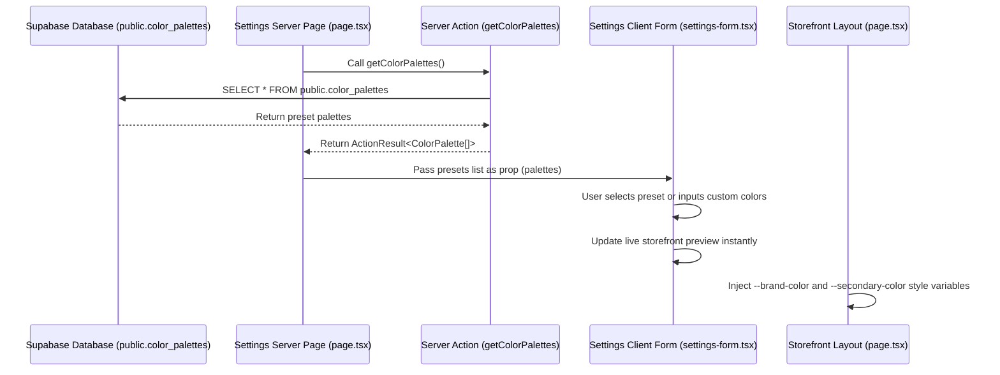
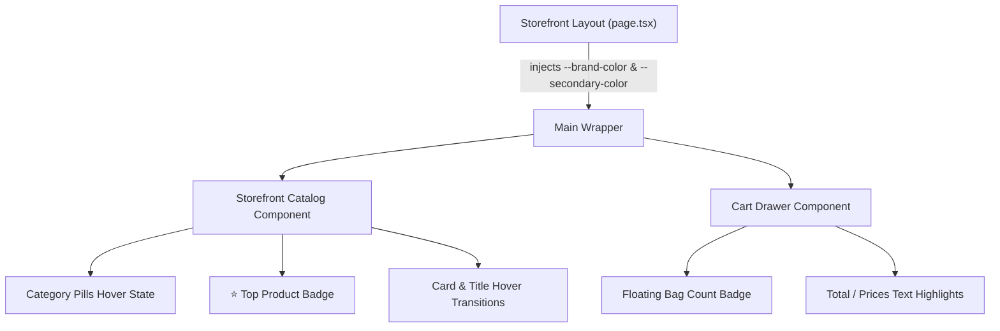

# Technical Design: Canva Color Palette and Customization

## 1. Technical Approach

The goal of this change is to enable merchants to select visual brand identities using Canva-style predefined color combinations or fully customized primary and secondary color pickers. Crucially, this capability is unlocked for **Free plan** merchants, removing previous limitations that locked their storefronts to the default violet color (`#7c3aed`).

### Architecture & Data Flow

To ensure a clean separation of concerns and maintainability, predefined color palettes will be stored in the database rather than hardcoded on the client. 



1. **Server-Side Fetching**:
   - `/src/app/dashboard/settings/page.tsx` (Next.js Server Component) fetches the preset list from the database via the server action `getColorPalettes` alongside other initial page data.
   - Presets are passed as a `palettes` prop down to the client component `SettingsForm`. This avoids client-side fetch effects or hydration discrepancies.
   
2. **Dashboard Interactive Form (`settings-form.tsx`)**:
   - A grid of color palette selectors displays the retrieved presets. Clicking a preset dynamically updates both the primary (`brand_color`) and secondary (`secondary_color`) color values inside the React Hook Form state.
   - Independent color picker widgets allow selecting any hex color when using custom combinations.
   - All locks and resets for `isFreePlan` are removed, allowing free plan tenants to save their chosen colors.

3. **Storefront Theme Engine (`src/app/[slug]/page.tsx`)**:
   - The storefront page reads `tenant.brand_color` and `tenant.secondary_color` regardless of the subscription plan.
   - These colors are bound directly as CSS custom properties (`--brand-color` and `--secondary-color`) in the root container wrapper style.
   - Accent colors in components (badges, buttons, hover states) read from these custom properties, maintaining visual uniformity.

---

## 2. Database Schema

A new `public.color_palettes` table will be introduced to hold the predefined Canva palettes.

### Table Structure: `public.color_palettes`

| Column Name | Data Type | Constraints | Description |
|---|---|---|---|
| `id` | `uuid` | `PRIMARY KEY`, `DEFAULT gen_random_uuid()` | Unique identifier |
| `name` | `text` | `UNIQUE`, `NOT NULL` | Preset label (e.g. Pastel, Warm) |
| `brand_color` | `text` | `NOT NULL` | Primary hex color code |
| `secondary_color` | `text` | `NOT NULL` | Secondary hex color code |
| `created_at` | `timestamp with time zone` | `DEFAULT timezone('utc'::text, now()) NOT NULL` | Creation timestamp |

### Row Level Security (RLS)
* **RLS Status**: Enabled.
* **Policies**:
  - **Select**: Public Read-Only Policy allows any client to fetch the predefined palettes.
    ```sql
    CREATE POLICY "Permitir lectura pública de paletas" ON public.color_palettes
      FOR SELECT TO public USING (true);
    ```
  - **Write/Modify**: No write policies are defined. Palettes are managed solely by database migration files.

### Seeding Migration
The migration script `supabase/migrations/20260609000000_color_palettes.sql` seeds the table with five base presets:

| Name | Brand Color (Primary) | Secondary Color |
|---|---|---|
| **Pastel** | `#fbcfe8` (Pink) | `#bae6fd` (Blue) |
| **Warm** | `#f97316` (Orange) | `#facc15` (Yellow) |
| **Neon** | `#06b6d4` (Cyan) | `#f43f5e` (Rose) |
| **Tech** | `#0f172a` (Slate) | `#3b82f6` (Blue) |
| **Nordic** | `#1e293b` (Charcoal) | `#64748b` (Slate Gray) |

---

## 3. Server Action

A new server action will be implemented in `src/lib/tenants/actions.ts` to query the palettes database:

```typescript
export interface ColorPalette {
  id: string;
  name: string;
  brand_color: string;
  secondary_color: string;
  created_at: string;
}

export async function getColorPalettes(): Promise<ActionResult<ColorPalette[]>> {
  try {
    const supabase = await createClient();
    const { data, error } = await supabase
      .from("color_palettes")
      .select("*")
      .order("name", { ascending: true });

    if (error) return { success: false, error: error.message };
    return { success: true, data: data as ColorPalette[] };
  } catch (err) {
    console.error(err);
    return { success: false, error: "Error al obtener paletas de colores" };
  }
}
```

### Plan Enforcement Removals
The existing `updateTenantSettings` function resets branding colors for Free plan tenants before saving them. This logic will be removed:

```diff
-    const subResult = await getTenantSubscription(id);
-    const planName = (subResult.success && subResult.data && subResult.data.plans)
-      ? subResult.data.plans.name
-      : "Free";
-
-    if (planName.toLowerCase().includes("free")) {
-      updateData.brand_color = "#7c3aed";
-      updateData.secondary_color = null;
-    }
```

---

## 4. UI Changes

### Merchant Dashboard Settings (`settings-form.tsx`)

1. **Custom Picker & Inputs**:
   - Provide custom pickers for both `brand_color` and `secondary_color`.
   - Implement custom color trigger buttons that call the native color selector, alongside text fields displaying the `#HEX` code.
2. **Preset Layout**:
   - Instead of using a client-side hardcoded array, render preset palettes dynamically from the `palettes` prop.
   - Render a custom card display for each palette showing a split badge previewing both primary and secondary colors. Selecting a palette automatically fills both form inputs.
3. **Lock & Restrictions Removal**:
   - Remove disabled states on color selection inputs when `isFreePlan` is true.
   - Remove the Premium Lock warning banner blocking visual identity customizer.
   - Remove the `useEffect` resetting color choices to violet for Free plan.

### Public Storefront Integration



#### Storefront Layout (`src/app/[slug]/page.tsx`)
- Read colors directly from database fields. Do not force `#7c3aed` for Free plan storefronts.
- Pass `--brand-color` and `--secondary-color` to the container styles:
  ```typescript
  const brandColor = tenant.brand_color || "#7c3aed";
  const secondaryColor = tenant.secondary_color || "#bae6fd";
  ```
  ```html
  <main 
    className="min-h-screen bg-zinc-50 dark:bg-black pb-24"
    style={{ 
      "--brand-color": brandColor,
      "--secondary-color": secondaryColor
    } as React.CSSProperties}
  >
  ```

#### Catalog Components (`src/components/storefront/storefront-catalog.tsx`)
- **Category Chips**: Update the non-active chip classes to use secondary color hover variables:
  ```html
  hover:text-[var(--secondary-color)] hover:border-[var(--secondary-color)]
  ```
- **Product Card Hover**: Update card hover transitions to light up borders with the secondary color:
  ```html
  hover:border-[var(--secondary-color)]
  ```
- **Product Name Hover**: Change active product card name hover styling to highlight using secondary accent:
  ```html
  group-hover:text-[var(--secondary-color)]
  ```
- **Product Badge**: Replace the static violet-600 background of the `⭐ Top` product badge to use `--secondary-color`:
  ```html
  <span 
    className="text-white text-[9px] font-black px-1.5 py-0.5 rounded-lg shadow-sm flex items-center gap-0.5 uppercase tracking-wide"
    style={{ backgroundColor: "var(--secondary-color)" }}
  >
    ⭐ Top
  </span>
  ```

#### Cart Drawer Component (`src/components/storefront/cart-drawer.tsx`)
- **Floating Shopping Bag Badge**: Apply the secondary color styling as the background and border for the floating item counter:
  ```html
  <span 
    className="absolute -top-3 -right-3 text-[10px] font-black h-5 w-5 rounded-xl flex items-center justify-center border-2 animate-in zoom-in"
    style={{ 
      backgroundColor: "var(--secondary-color)", 
      color: "#ffffff", 
      borderColor: "var(--secondary-color)" 
    }}
  >
    {itemCount}
  </span>
  ```
- **Text Highlights**: Re-bind items prices, titles, or checkout buttons highlights inside the cart to read from `--secondary-color` when appropriate to create a cohesive accent pattern.

---

## 5. Testing Strategy

### Migration Testing
A new migration unit test will be created at `supabase/migrations/20260609000000_color_palettes.test.ts`. This test reads the SQL script and asserts structure validation:
- Assert that the table `public.color_palettes` is created with fields: `id`, `name`, `brand_color`, `secondary_color`, and `created_at`.
- Assert that RLS is enabled on `public.color_palettes`.
- Assert that the public select policy is declared.
- Assert that seed statements exist for predefined palettes.

### Dashboard Settings Form Testing (`settings-form.test.tsx`)
1. **Mock Database Palettes**:
   - Provide a set of mock palettes to the `SettingsForm` component during renders.
2. **Unlock Assertion updates**:
   - Refactor assertions checking that color customization inputs are disabled for free plan tenants.
   - Assert that preset color buttons, custom pickers, and hex code text inputs are **enabled** and interactive regardless of the `planName` parameter (testing both `planName="Free"` and `planName="Premium"` states).
3. **Preset Clicking Logic**:
   - Assert that clicking a preset correctly updates form values for both colors.
