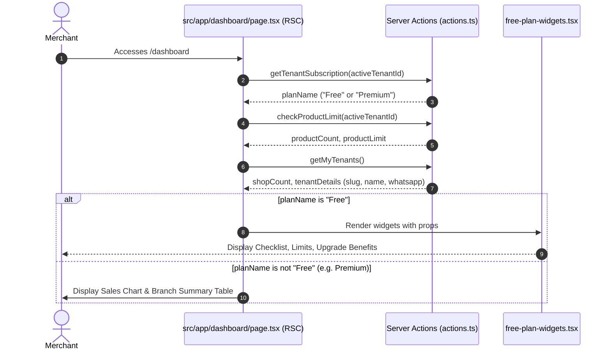

# Technical Design: Free Plan Dashboard Widgets

## 1. Technical Approach
To improve onboarding and conversion rates of Free plan merchants, we introduce three visual widgets directly to the dashboard page:
- **Onboarding Checklist**: Displays checklist progress, checking off completed setup tasks.
- **Usage Limits**: Tracks active products and shops/branches limits with dynamic colored progress bars.
- **Premium Benefits**: Shows premium upgrade advantages and links to the pricing section.

To maintain Next.js App Router best practices, the widgets are implemented as purely presentational, client-component-free React components. The parent route `/dashboard/page.tsx` acts as a Server Component which fetches subscription plans, limits, and setup states using Server Actions. It then conditionally passes these values down to the layout widgets.

## 2. Architecture Decisions & Rationale
- **React Component Placement**: Widgets are written in `src/components/dashboard/free-plan-widgets.tsx`. By keeping the widgets as pure presentational components, we ensure that they do not introduce side effects or duplicate data-fetching logic.
- **Server Actions for Data Fetching**: We utilize Next.js Server Components on the dashboard page (`src/app/dashboard/page.tsx`) to query data via Server Actions (`getMyTenants()`, `checkProductLimit()`, `getTenantSubscription()`). This ensures security, reduces client-side bundle size, and allows fast data access.
- **No Client Component Overheads**: Standard props are passed from the Server Component to the widgets. We avoid loading state complexities and hooks (like `useEffect` or `useState`) within these widgets, promoting high performance.

## 3. Data Flow


## 4. Interfaces & Contracts

### `UsageLimitsWidgetProps`
Defines current usage and limits for shops and products.
```typescript
export interface UsageLimitsWidgetProps {
  currentProducts: number;
  productLimit: number;
  currentShops: number;
  shopLimit?: number;
}
```

### `OnboardingChecklistWidgetProps`
Defines the current state of a tenant for determining checklist completion status.
```typescript
export interface OnboardingChecklistWidgetProps {
  storeName?: string;
  storeSlug?: string;
  whatsappPhone?: string;
  productCount: number;
}
```

## 5. File Changes

### `src/components/dashboard/free-plan-widgets.tsx` (Create)
- Implements `OnboardingChecklistWidget`, `UsageLimitsWidget`, and `PremiumBenefitsWidget`.
- Handles checklist completion rules:
  1. **Nombre personalizado**: `storeName !== "Mi Tienda"`
  2. **URL personalizada**: `storeSlug` present and does not start with `"tienda-"`
  3. **Teléfono de WhatsApp**: `whatsappPhone` is not empty.
  4. **Productos cargados**: `productCount > 0`
- Colors product limit progress bar to `bg-amber-500` (amber) and shows upgrade warning with "Mejorar Plan" CTA when limit is reached.

### `src/app/dashboard/page.tsx` (Modify)
- Fetch active tenant details (name, slug, whatsapp_phone) and product counts.
- Fetch current subscription info via `getTenantSubscription`.
- Conditionally render free plan widgets if plan is `"Free"`, else render standard sales performance chart and shops table.

### `src/app/dashboard/performance.test.tsx` (Modify)
- Add performance and layout unit tests to verify conditional rendering behavior based on mocked plan response.

## 6. Testing Strategy
Unit tests in `performance.test.tsx` assert the correct rendering of the dashboard components for different subscription tiers by mocking plan responses:
- **Free Plan layout test**:
  - Mocks `getTenantSubscription` returning a plan named `"Free"`.
  - Asserts that standard elements (`SampleSalesChart` and `ShopSummaryTable`) are hidden.
  - Asserts that the free plan widgets (`OnboardingChecklistWidget`, `UsageLimitsWidget`, `PremiumBenefitsWidget`) and their key visual hooks (progress bars) are present.
- **Premium Plan layout test**:
  - Mocks `getTenantSubscription` returning a plan named `"Premium"`.
  - Asserts that standard elements (`SampleSalesChart` and `ShopSummaryTable`) are displayed.
  - Asserts that free plan widgets are hidden.

## 7. Migration
This is a pure frontend layout change:
- **Database Schema**: No migrations are required. It consumes existing schema fields (`tenant.name`, `tenant.slug`, `tenant.whatsapp_phone`, `subscriptions.plans`).
- **Rollback Plan**: To rollback, revert changes in `src/app/dashboard/page.tsx` and `src/app/dashboard/performance.test.tsx`, and delete `src/components/dashboard/free-plan-widgets.tsx`.
